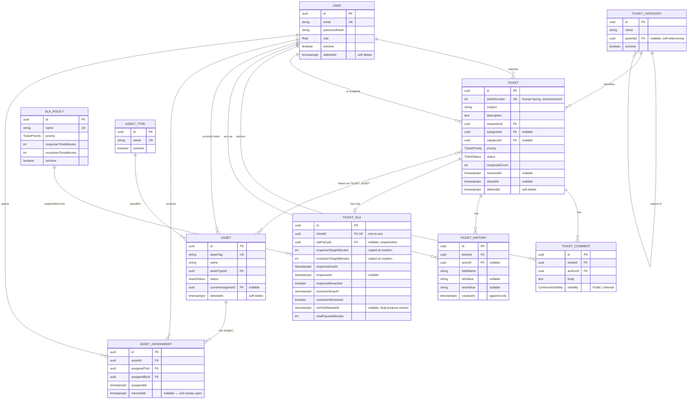
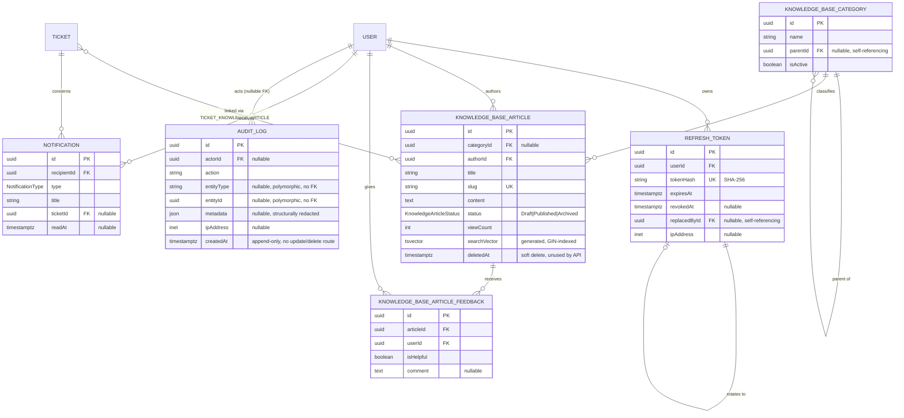

# Database Schema (ERD)

PostgreSQL with Prisma as the schema/migration source of truth
(`backend/prisma/schema.prisma`). UUID primary keys throughout, except
`Ticket.ticketNumber` (a human-facing auto-incrementing integer) and the
two link tables, which use composite primary keys. Split into two diagrams
for readability — core ITSM tables, then the supporting/content/security
tables — with the tables that bridge both groups (`User`, `Ticket`)
repeated in each.

Constructs Prisma cannot express declaratively (CHECK constraints,
partial/filtered unique indexes, the generated `tsvector` search column)
are added by hand to the migration SQL and are called out below rather
than shown on the diagram, which is ERD notation, not DDL.

See [`docs/diagrams/`](../diagrams/README.md) for the full eleven-diagram
set, including these two ERDs alongside the runtime architecture, auth
flow, RBAC, SLA lifecycle, CI pipeline, deployment topology, and
ticket-mutation concurrency diagrams.

## Core ITSM tables

Notable constraints not visible in ERD notation:

- `tickets_closed_requires_resolved` (CHECK): a ticket cannot reach
  `Closed` without `resolvedAt` set.
- A partial unique index on `asset_assignments` allows at most one **open**
  assignment (`returnedAt IS NULL`) per asset at a time — the mechanism
  that keeps `Asset.status`/`currentAssigneeId` and the ledger from
  drifting apart under concurrent writes.
- `TicketAsset` (the ticket↔asset link) is a composite-key join table
  (`@@id([ticketId, assetId])`), not shown as its own box above; the
  `}o--o{` edge between `TICKET` and `ASSET` represents it.

## Supporting: knowledge base, notifications, audit, sessions

Notable modeling decisions not visible in ERD notation:

- `AuditLog.entityType`/`entityId` are a deliberate polymorphic reference
  with **no foreign key** — an approved trade-off from the Phase 2 design
  (see ADR-025) so the audit table doesn't need a constraint per
  referenceable entity type.
- `KnowledgeBaseArticle.searchVector` is a PostgreSQL `GENERATED ALWAYS AS
  ... STORED` `tsvector` column with a GIN index, added by hand to the
  migration SQL — full-text search runs entirely in Postgres via
  `ts_rank`, with no search service dependency (ADR-017/022).
- `Notification` exists in the schema (and is shown here for completeness)
  but has no application code using it yet — reserved for a phase that was
  never scheduled, not a bug.
- `RefreshToken.replacedById` self-references the next token in a
  rotation chain, which is how reuse-of-an-already-rotated-token is
  detected and used to revoke an entire token family.

## Full table count

18 tables, 7 enums (`Role`, `TicketPriority`, `TicketStatus`,
`CommentVisibility`, `AssetStatus`, `KnowledgeArticleStatus`,
`NotificationType`). See `backend/prisma/schema.prisma` for the
authoritative definition and `backend/prisma/migrations/` for the exact
SQL, including the hand-added CHECK constraints, partial unique indexes,
and the generated search column.
