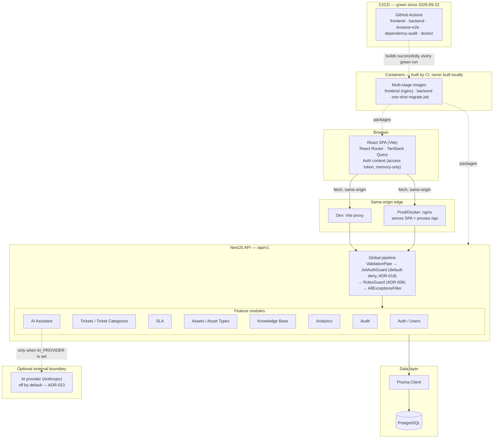
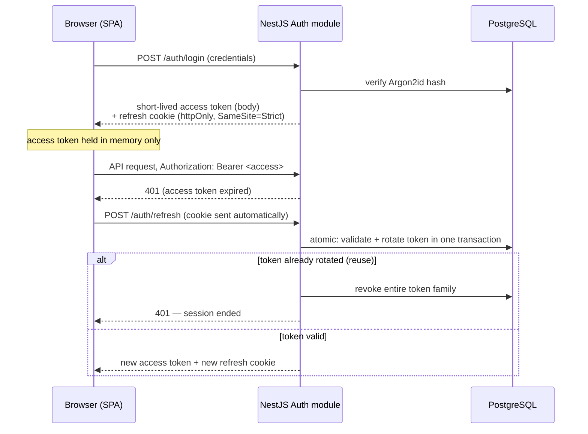

# System Architecture

OpsNow is a conventional two-tier web application: a React single-page app
calling a versioned NestJS REST API, backed by a single PostgreSQL
database. There is deliberately no microservices split, no message queue,
and no monorepo tooling (ADR-001/017).

See [`docs/diagrams/`](../diagrams/README.md) for the full eleven-diagram
set (runtime architecture, both ERDs, auth flow, RBAC, SLA lifecycle, CI
pipeline, deployment topology, and ticket-mutation concurrency), of which
the diagram below is one.

## Why same-origin, not CORS

The refresh token cookie is `httpOnly`, `SameSite=Strict`, and path-scoped;
the backend enables no CORS and rejects a cross-origin `Origin` header on
`/auth/refresh` and `/auth/logout`. That means the browser must see the API
as same-origin with the SPA — in development through Vite's dev proxy, in
a container through nginx. A split-origin deployment is a design change,
not a configuration flag (ADR-027).

## Request pipeline

Every request passes through the same global pipeline regardless of which
module handles it:

1. **`ValidationPipe`** — whitelist, `forbidNonWhitelisted`, transform.
   Unexpected fields are rejected before a handler ever runs.
2. **`JwtAuthGuard`** — default-deny (ADR-018). A route is reachable
   without a valid access token only if explicitly marked `@Public()`.
3. **`RolesGuard`** — enforces `@Roles(...)` annotations and fails closed
   on an empty role list (ADR-006).
4. Row-level visibility inside each service (`ticketVisibilityWhere`,
   `asset-visibility.ts`, and equivalents) — which rows a caller may see
   at all, applied to every read and to the `where` clause of every write.
5. **`AllExceptionsFilter`** — a consistent error shape on the way out,
   never a stack trace.

## Refresh-token flow (high level)

Refresh-on-401 is single-flight and cross-tab serialized in the frontend
(via `navigator.locks`), because presenting an already-rotated refresh
token is treated as suspected theft and revokes the whole token family —
so two tabs racing a refresh is a real failure mode, not a theoretical one.

## Optional AI boundary

The AI assistant module sits behind its own provider abstraction
(`ai.provider.factory.ts`) with three implementations: `disabled` (the
default — no `AI_PROVIDER`/`AI_API_KEY` set), `mock` (canned output for
demos, rejected in production), and `anthropic` (real calls, ADR-023).
Nothing the AI module produces can change a ticket by itself — a
suggestion is applied only by a second explicit click through the
ordinary `PATCH /tickets/:id` mutation, which gets the same validation,
history write and 403/409 handling as a change a person typed.

## CI and containers — proven in CI, still untried locally

The diagram above marks the CI pipeline and container images with dashed
boundaries because they run somewhere other than this repository's own
checkout, not because they're unverified: `.github/workflows/ci.yml` has
run repeatedly on `origin/main` and been green on every run since
2026-09-22, including the `docker` job building all three container
images and validating `docker compose config`/`nginx -t` every time. What
remains genuinely untried is **local** execution — Docker has never been
installed or run on the authoring machine, so no local `docker compose
up` has happened even though CI has proven the images build. See
`docs/docker.md` and `docs/deployment.md`.
